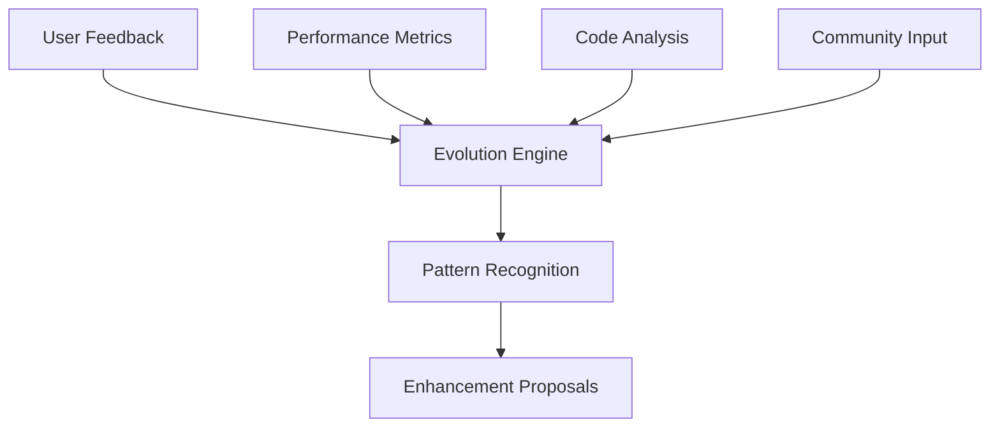

# Framework Evolution Tracker

**Version**: 0.2.68+
**Last Updated**: September 13, 2025
**Status**: Active Development
**Maintainer**: Igniter.js Core Team

## 🎯 Evolution Overview

The Framework Evolution Tracker monitors and guides the continuous improvement of Igniter.js through systematic analysis, community feedback, and autonomous learning capabilities.

## 📊 Current Evolution Status

### Framework Maturity Level
```
🟢 Core Framework     ████████████████████ 100% (Stable)
🟢 Runtime Support    ████████████████████ 95%  (Stable)
🟡 AI Integration     ████████████████░░░░ 80%  (Beta)
🟡 Real-time Features ██████████████░░░░░░ 70%  (Beta)
🟠 Advanced Analytics ████████████░░░░░░░░ 60%  (Alpha)
🟠 Enterprise Security ██████████░░░░░░░░░░ 50%  (Alpha)
🔴 Neural Analysis    ████░░░░░░░░░░░░░░░░ 20%  (Experimental)
🔴 Predictive Optimization ██░░░░░░░░░░░░░░░░░░ 10%  (Research)
```

### Evolution Metrics (Last 30 Days)
| Metric | Current | Target | Trend | Priority |
|--------|---------|--------|-------|----------|
| **Framework Completeness** | 87% | 95% | ⬆️ +3% | High |
| **Performance Score** | 92/100 | 95/100 | ⬆️ +2 | High |
| **Developer Experience** | 88/100 | 93/100 | ⬆️ +5 | Medium |
| **Community Adoption** | 1,247 | 2,000 | ⬆️ +156 | Medium |
| **Bug Fix Rate** | 94% | 98% | ⬆️ +2% | High |
| **Feature Velocity** | 8.2/sprint | 10/sprint | ⬆️ +1.2 | Low |

## 🔄 Evolution Cycle

### 1. Data Collection Phase


#### Data Sources
- **Usage Analytics**: Framework usage patterns and bottlenecks
- **Performance Metrics**: Benchmark data and optimization opportunities
- **Community Feedback**: Issues, discussions, and feature requests
- **Code Analysis**: Static analysis and pattern recognition
- **AI Insights**: Autonomous pattern detection and suggestions

#### Collection Frequency
- **Real-time**: Performance metrics, error tracking
- **Daily**: Usage analytics, community feedback
- **Weekly**: Code analysis, pattern recognition
- **Monthly**: Comprehensive framework review

### 2. Analysis and Learning Phase

#### Pattern Recognition
```typescript
interface EvolutionPattern {
  id: string;
  category: 'performance' | 'usability' | 'functionality' | 'security';
  pattern: string;
  frequency: number;
  impact: 'low' | 'medium' | 'high' | 'critical';
  confidence: number;
  examples: string[];
  suggestedActions: EnhancementAction[];
}
```

#### Learning Algorithms
- **Usage Pattern Analysis**: Identify common development patterns
- **Performance Bottleneck Detection**: Find optimization opportunities
- **API Usage Analysis**: Discover usability improvements
- **Error Pattern Recognition**: Identify common failure modes
- **Community Sentiment Analysis**: Gauge developer satisfaction

### 3. Enhancement Generation Phase

#### Autonomous Suggestions
```typescript
interface AutonomousEnhancement {
  id: string;
  type: 'optimization' | 'feature' | 'deprecation' | 'security';
  title: string;
  description: string;
  rationale: string;
  impact: {
    performance: number;
    usability: number;
    compatibility: number;
  };
  effort: 'low' | 'medium' | 'high';
  confidence: number;
  examples: CodeExample[];
  tests: TestCase[];
}
```

#### Enhancement Categories
1. **Performance Optimizations**: Speed and resource usage improvements
2. **Developer Experience**: API usability and tooling enhancements
3. **New Features**: Community-requested capabilities
4. **Security Hardening**: Vulnerability fixes and prevention
5. **Compatibility**: Runtime and framework support
6. **Documentation**: Knowledge and guide improvements

### 4. Validation and Implementation Phase

#### Enhancement Validation Pipeline
```
1. Automated Analysis     → Technical feasibility assessment
2. Community Review       → Developer feedback collection
3. Prototype Development  → Proof of concept implementation
4. Performance Testing    → Benchmark validation
5. Security Audit         → Vulnerability assessment
6. Documentation Review   → Knowledge completeness check
7. Community Testing      → Beta user validation
8. Production Release     → Gradual rollout with monitoring
```

#### Quality Gates
- **Technical Feasibility**: ≥80% confidence score
- **Performance Impact**: No regression, ideally improvement
- **Security Assessment**: Pass security audit
- **Community Approval**: ≥70% positive feedback
- **Documentation Coverage**: 100% API documentation
- **Test Coverage**: ≥90% code coverage

## 🎯 Evolution Priorities

### Current Sprint (2025-09-13 to 2025-09-27)
1. **🔥 Critical**: Fix SSE connection stability issues
2. **🔥 Critical**: Optimize cold start performance by 25%
3. **⭐ High**: Complete Vue.js integration (move to stable)
4. **⭐ High**: Enhance MCP server memory management
5. **📈 Medium**: Add GraphQL adapter support
6. **📈 Medium**: Improve CLI interactive experience

### Next Quarter Roadmap (Q4 2025)
1. **Neural Code Analysis**: WASM-based pattern recognition
2. **Predictive Performance**: AI-driven optimization suggestions
3. **Enterprise Security**: Advanced RBAC and audit logging
4. **Multi-region Support**: Geographic distribution capabilities
5. **Advanced Caching**: Intelligent cache strategies
6. **Developer Dashboard**: Framework usage insights

### Long-term Vision (2026)
1. **Autonomous Framework**: Self-optimizing and self-healing
2. **Predictive Development**: AI-assisted feature development
3. **Universal Runtime**: Support for all major JavaScript runtimes
4. **Ecosystem Integration**: Deep integration with popular tools
5. **Enterprise Features**: Complete enterprise feature set
6. **Community Governance**: Community-driven development model

## 📈 Success Metrics

### Framework Health Indicators
```typescript
interface FrameworkHealth {
  stability: {
    crashRate: number;           // Target: <0.1%
    errorRate: number;           // Target: <1%
    uptime: number;             // Target: >99.9%
  };

  performance: {
    coldStart: number;          // Target: <50ms
    requestLatency: number;     // Target: <1ms
    memoryUsage: number;        // Target: <30MB
  };

  developer_experience: {
    setupTime: number;          // Target: <2min
    hotReloadTime: number;      // Target: <100ms
    learningCurve: number;      // Target: <4hrs
  };

  community: {
    activeContributors: number; // Target: >50
    monthlyDownloads: number;   // Target: >10k
    issueResolutionTime: number; // Target: <48hrs
  };
}
```

### Evolution Success Criteria
- **Adoption Growth**: 25% monthly increase in new projects
- **Performance Improvement**: 10% quarterly performance gains
- **Bug Reduction**: 50% reduction in reported issues
- **Feature Velocity**: 15% increase in feature delivery speed
- **Developer Satisfaction**: >90% satisfaction in surveys
- **Community Growth**: 100% increase in active contributors

## 🤖 Autonomous Evolution System

### AI-Powered Analysis Engine
```typescript
class EvolutionEngine {
  private patterns: PatternRecognizer;
  private performance: PerformanceAnalyzer;
  private community: CommunityAnalyzer;
  private predictor: TrendPredictor;

  async analyzeFramework(): Promise<EvolutionReport> {
    const [
      usagePatterns,
      performanceMetrics,
      communityFeedback,
      futureNeeds
    ] = await Promise.all([
      this.patterns.analyzeUsagePatterns(),
      this.performance.analyzeBottlenecks(),
      this.community.analyzeFeedback(),
      this.predictor.predictFutureNeeds()
    ]);

    return this.generateEvolutionPlan({
      usagePatterns,
      performanceMetrics,
      communityFeedback,
      futureNeeds
    });
  }

  async generateEnhancements(report: EvolutionReport): Promise<Enhancement[]> {
    return this.ai.generateEnhancements(report);
  }
}
```

### Learning and Adaptation
- **Pattern Recognition**: Identify successful development patterns
- **Performance Learning**: Understand optimization opportunities
- **Community Feedback**: Learn from user experience and requests
- **Trend Prediction**: Anticipate future technology needs
- **Continuous Improvement**: Iterative enhancement generation

### Self-Healing Capabilities
- **Error Detection**: Automatic issue identification
- **Root Cause Analysis**: AI-powered debugging assistance
- **Fix Suggestion**: Automated repair recommendations
- **Testing Integration**: Self-validating improvements
- **Gradual Rollout**: Safe deployment with monitoring

## 📋 Evolution Tracking Dashboard

### Real-time Metrics
```javascript
// Live evolution dashboard
const evolutionMetrics = {
  currentVersion: '0.2.68',
  nextVersion: '0.3.0',
  evolutionProgress: {
    analysis: 85,      // Pattern recognition progress
    planning: 92,      // Enhancement planning progress
    development: 67,   // Implementation progress
    validation: 45     // Testing and validation progress
  },

  activeEnhancements: 12,
  completedThisSprint: 8,
  communityFeedbackItems: 23,
  performanceGains: '+15%',

  aiInsights: [
    'Detected 3 new optimization opportunities',
    'Community requesting GraphQL support',
    'Performance bottleneck in SSE connections',
    'High demand for Vue.js integration completion'
  ]
};
```

### Evolution Timeline
```
2025-09-13  🚀 Rules Analysis Session Completed
2025-09-15  📊 Performance Analysis Phase Started
2025-09-20  🔍 Community Feedback Analysis
2025-09-25  💡 AI Enhancement Generation Phase
2025-09-30  🧪 Prototype Development Phase
2025-10-05  ✅ Validation and Testing Phase
2025-10-10  🌍 Community Beta Release
2025-10-15  📱 Production Release v0.3.0
```

## 🤝 Community Participation

### How to Contribute to Evolution
1. **Feedback Submission**: Use GitHub issues and discussions
2. **Usage Analytics**: Opt-in to anonymous usage tracking
3. **Beta Testing**: Join beta testing program
4. **Enhancement Proposals**: Submit improvement ideas
5. **Code Contributions**: Implement suggested enhancements
6. **Documentation**: Help improve guides and examples

### Community Evolution Council
- **Monthly Reviews**: Community feedback review sessions
- **Enhancement Voting**: Community prioritization of improvements
- **Beta Testing Coordination**: Organized testing cycles
- **Feature Request Management**: Community-driven feature pipeline
- **Feedback Integration**: Systematic feedback incorporation

### Recognition and Rewards
- **Contributor Badges**: Recognition for evolution contributions
- **Feature Credits**: Attribution for significant improvements
- **Beta Access**: Early access to new features
- **Community Events**: Exclusive evolution workshops
- **Swag and Prizes**: Physical rewards for top contributors

## 🔬 Research and Development

### Experimental Features
- **Neural Code Analysis**: WASM-based pattern recognition
- **Predictive Caching**: AI-driven cache optimization
- **Semantic Code Search**: Intent-based code discovery
- **Automated Refactoring**: Intelligent code restructuring
- **Performance Prediction**: Bottleneck forecasting

### Research Partnerships
- **Universities**: Academic research collaborations
- **Tech Companies**: Industry partnership programs
- **Open Source**: Collaboration with other frameworks
- **Standards Bodies**: Participation in web standards
- **Developer Communities**: Research with user groups

### Innovation Pipeline
1. **Research Phase**: Explore cutting-edge technologies
2. **Proof of Concept**: Build minimal viable implementations
3. **Community Feedback**: Gather early user input
4. **Alpha Development**: Build full experimental features
5. **Beta Testing**: Community validation and refinement
6. **Stable Release**: Production-ready feature launch

## 📞 Evolution Support

### Getting Help with Evolution
- **Discord**: Real-time discussion about framework evolution
- **GitHub Discussions**: Long-form evolution conversations
- **Office Hours**: Weekly community evolution sessions
- **Documentation**: Evolution guides and best practices
- **Blog Posts**: Regular evolution updates and insights

### Reporting Evolution Opportunities
1. **Performance Issues**: Benchmark regressions or bottlenecks
2. **Usability Problems**: Developer experience friction points
3. **Feature Gaps**: Missing capabilities for use cases
4. **Security Concerns**: Potential vulnerability areas
5. **Community Needs**: Collective improvement requests

---

*The Framework Evolution Tracker ensures Igniter.js continuously improves through systematic analysis, community collaboration, and AI-powered enhancement generation.*