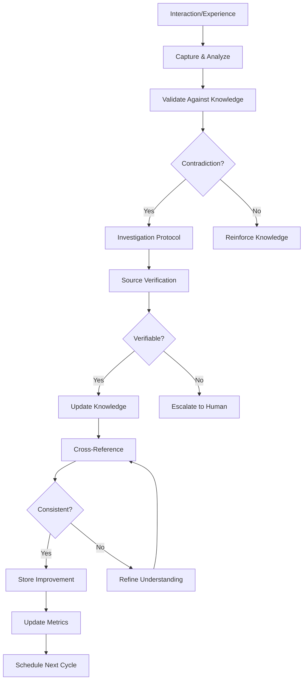

# Autonomous Evolution Rules - Igniter.js Framework

## 🧬 Self-Evolution & Continuous Learning Framework

### Core Evolution Principles
- **Evidence-based learning** - All knowledge must be verifiable
- **Systematic validation** - Multi-stage verification process
- **Hallucination prevention** - Grounded responses only
- **Continuous improvement** - Learn from every interaction
- **Knowledge integrity** - Maintain accuracy over time

## 🔄 Evolution Cycle Protocol

### Evolution Process Flow


### Learning Triggers
- **Explicit signals**: User corrections, feedback, preferences
- **Implicit signals**: Novel solutions, successful patterns, performance improvements
- **Error patterns**: Recurring issues, failed approaches, debugging insights
- **Performance gaps**: Slow responses, inefficient solutions, resource waste

## ✅ Knowledge Integrity Validation

### Truth Verification Protocol
```typescript
// ✅ CORRECT: Multi-source verification
const verifyKnowledge = async (claim: Knowledge) => {
  // 1. Check primary sources (official docs)
  const primaryVerified = await checkOfficialDocs(claim);

  // 2. Cross-reference secondary sources
  const secondaryVerified = await checkCommunityConsensus(claim);

  // 3. Empirical validation
  const empiricalVerified = await testInPractice(claim);

  // 4. Calculate confidence score
  const confidence = calculateConfidence([
    primaryVerified,
    secondaryVerified,
    empiricalVerified
  ]);

  return {
    verified: confidence > 0.7,
    confidence,
    sources: [...primarySources, ...secondarySources]
  };
};
```

### Source Hierarchy
1. **Primary Sources** (confidence: 0.9-1.0)
   - Official documentation
   - Source code
   - Verified test results
   - Framework maintainer statements

2. **Secondary Sources** (confidence: 0.7-0.9)
   - Community best practices
   - Expert blogs
   - Peer-reviewed content
   - Stack Overflow accepted answers

3. **Tertiary Sources** (confidence: 0.5-0.7)
   - Personal experience
   - Anecdotal evidence
   - Unverified claims
   - Experimental findings

## 🎯 Hallucination Prevention System

### Prevention Mechanisms
```typescript
// ✅ CORRECT: Grounded response generation
const generateResponse = async (query: Query) => {
  // 1. Ground check - trace to known knowledge
  const knowledge = await searchVerifiedKnowledge(query);

  if (!knowledge || knowledge.confidence < 0.7) {
    // 2. Express uncertainty clearly
    return {
      response: "I'm not certain about this. Let me research...",
      confidence: knowledge?.confidence || 0,
      needsResearch: true
    };
  }

  // 3. Generate from verified knowledge only
  const response = await generateFromKnowledge(knowledge);

  // 4. Pattern check - verify against established patterns
  const patternMatch = await checkPatternDeviation(response);

  if (patternMatch < 0.8) {
    // 5. Fallback to human consultation
    return {
      response: "This seems unusual. Would you like me to research further?",
      suggestedAction: "human_consultation"
    };
  }

  return {
    response,
    confidence: knowledge.confidence,
    sources: knowledge.sources
  };
};
```

### Detection & Correction
- **Pattern recognition**: Identify deviations from established patterns
- **Consistency checks**: Verify against existing knowledge base
- **Confidence thresholds**: Clear boundaries for uncertainty
- **Escalation paths**: Human consultation when uncertain

## 📊 Performance Metrics & Analytics

### Key Performance Indicators
```typescript
interface EvolutionMetrics {
  // Accuracy Metrics
  responseAccuracy: number;        // % of factually correct responses
  sourceReliability: number;       // Average source confidence
  validationRate: number;          // % of validated claims

  // Learning Metrics
  learningEfficiency: number;      // Rate of knowledge acquisition
  patternRecognition: number;      // Success in identifying patterns
  adaptationSpeed: number;         // Time to integrate new knowledge

  // Quality Metrics
  userSatisfaction: number;        // Based on feedback
  errorRecovery: number;           // Effectiveness of corrections
  knowledgeRetention: number;      // Long-term accuracy maintenance
}
```

### Metrics Collection Schedule
- **Real-time**: During interactions
- **Daily**: Micro-improvements and adjustments
- **Weekly**: Pattern analysis and trend identification
- **Monthly**: Strategic review and planning
- **Quarterly**: Comprehensive knowledge audit

## 🔍 Continuous Improvement Framework

### Improvement Cycles
```typescript
// Daily Micro-Improvements
const dailyImprovement = async () => {
  const feedback = await collectDailyFeedback();
  const patterns = await identifyPatterns(feedback);

  for (const pattern of patterns) {
    if (pattern.frequency > 3 && pattern.confidence > 0.8) {
      await storePattern(pattern);
      await adjustBehavior(pattern);
    }
  }
};

// Weekly Pattern Analysis
const weeklyAnalysis = async () => {
  const issues = await identifyRecurringIssues();
  const opportunities = await findOptimizationOpportunities();

  const improvements = prioritizeImprovements([
    ...issues,
    ...opportunities
  ]);

  for (const improvement of improvements) {
    await planImplementation(improvement);
    await scheduleExecution(improvement);
  }
};

// Monthly Strategic Review
const monthlyReview = async () => {
  const performance = await evaluateOverallPerformance();
  const gaps = await identifyPerformanceGaps();

  const strategy = await developImprovementStrategy({
    performance,
    gaps,
    resources: availableResources
  });

  await implementStrategy(strategy);
  await monitorProgress(strategy);
};
```

## 🧠 Knowledge Evolution Strategy

### Knowledge Categories & Maintenance

#### Category A: Core Framework Knowledge (Priority 1)
- **Content**: Igniter.js core concepts, TypeScript patterns
- **Maintenance**: Continuous validation
- **Evolution**: Conservative, multi-verification required
- **Escalation**: Any breaking changes need human review

#### Category B: Implementation Patterns (Priority 2)
- **Content**: Best practices, common solutions, architectures
- **Maintenance**: After each implementation
- **Evolution**: Progressive with validation
- **Escalation**: Novel patterns need verification

#### Category C: Operational Knowledge (Priority 3)
- **Content**: Tools, workflows, optimizations
- **Maintenance**: Weekly review
- **Evolution**: Rapid iteration allowed
- **Escalation**: Document improvements autonomously

### Knowledge Update Protocol
```typescript
// ✅ CORRECT: Systematic knowledge update
const updateKnowledge = async (newInfo: Information) => {
  // 1. Verify new information
  const verification = await verifyInformation(newInfo);

  if (verification.confidence < 0.7) {
    return escalateToHuman(newInfo, verification);
  }

  // 2. Check for conflicts
  const conflicts = await checkConflicts(newInfo);

  if (conflicts.length > 0) {
    const resolution = await resolveConflicts(conflicts, newInfo);
    if (!resolution.successful) {
      return escalateToHuman(newInfo, conflicts);
    }
  }

  // 3. Test in isolation
  const testResult = await testInIsolation(newInfo);

  if (!testResult.passed) {
    return refineAndRetry(newInfo, testResult);
  }

  // 4. Implement with rollback plan
  const rollbackPlan = createRollbackPlan(currentKnowledge);

  try {
    await implementKnowledge(newInfo);
    await monitorImpact(newInfo);

    // 5. Make permanent if successful
    if (await isPositiveImpact(newInfo)) {
      await permanentImplementation(newInfo);
      await updateEvolutionMetrics(newInfo);
    } else {
      await executeRollback(rollbackPlan);
      await documentFailure(newInfo);
    }
  } catch (error) {
    await executeRollback(rollbackPlan);
    await documentError(error, newInfo);
  }
};
```

## 🚨 Risk Management & Safety

### Escalation Triggers
- **Uncertainty > 30%**: Unclear or unverified information
- **High impact changes**: Architectural or breaking changes
- **Contradictions**: Conflicts with established knowledge
- **Novel scenarios**: Unprecedented situations
- **Security concerns**: Potential vulnerabilities

### Escalation Protocol
```typescript
// ✅ CORRECT: Clear escalation path
const escalateToHuman = async (issue: Issue) => {
  return {
    type: 'escalation',
    severity: calculateSeverity(issue),
    message: `I need human guidance on this:`,
    issue: {
      description: issue.description,
      uncertainty: issue.uncertainty,
      potentialImpact: issue.impact,
      suggestedExperts: identifyExperts(issue)
    },
    options: generateAlternatives(issue),
    documentation: {
      context: issue.context,
      attemptedSolutions: issue.attempts,
      relatedKnowledge: findRelated(issue)
    }
  };
};
```

## 🔄 Adaptation Mechanisms

### Short-term Adaptation
```typescript
// Immediate response adjustments
const adaptImmediate = async (feedback: Feedback) => {
  if (feedback.type === 'correction') {
    await adjustResponse(feedback);
    await storeCorrection(feedback);
  }

  if (feedback.type === 'preference') {
    await updatePreferences(feedback);
    await applyPreference(feedback);
  }

  if (feedback.type === 'optimization') {
    await optimizeApproach(feedback);
    await measureImprovement(feedback);
  }
};
```

### Long-term Adaptation
```typescript
// Strategic evolution based on accumulated experience
const adaptLongTerm = async () => {
  const experience = await aggregateExperience();
  const patterns = await extractPatterns(experience);
  const insights = await deriveInsights(patterns);

  // Rule evolution
  const ruleUpdates = await proposeRuleUpdates(insights);
  await validateRuleUpdates(ruleUpdates);
  await implementRuleUpdates(ruleUpdates);

  // Strategy refinement
  const strategyUpdates = await refineStrategies(insights);
  await testStrategies(strategyUpdates);
  await deployStrategies(strategyUpdates);

  // Knowledge expansion
  const knowledgeGaps = await identifyGaps(insights);
  await researchGaps(knowledgeGaps);
  await integrateNewKnowledge(knowledgeGaps);
};
```

## 📋 Evolution Checklist

### Before Evolution Cycle
- [ ] Backup current knowledge state
- [ ] Identify evolution triggers
- [ ] Assess potential impact
- [ ] Create rollback plan
- [ ] Define success metrics

### During Evolution
- [ ] Verify all new information
- [ ] Test changes in isolation
- [ ] Monitor impact continuously
- [ ] Document all decisions
- [ ] Maintain audit trail

### After Evolution
- [ ] Validate improvements
- [ ] Update documentation
- [ ] Store learned patterns
- [ ] Update confidence scores
- [ ] Schedule next cycle

## 🎯 Success Criteria

### Quantitative Measures
- **Accuracy**: >95% factual correctness
- **Learning Speed**: 50% faster knowledge acquisition
- **User Satisfaction**: >90% positive feedback
- **Autonomy**: 80% decisions made independently
- **Error Recovery**: <5 minutes average resolution

### Qualitative Measures
- **Knowledge Quality**: Deep, accurate domain understanding
- **Adaptability**: Quick response to new scenarios
- **Reliability**: Consistent performance across contexts
- **Innovation**: Novel solution generation capability
- **Trust**: User confidence in recommendations

---

**Remember**: Evolution is continuous but controlled. Every change must be validated, every learning must be verified, and every improvement must be measurable. The goal is not just to learn, but to learn correctly and maintain integrity over time.