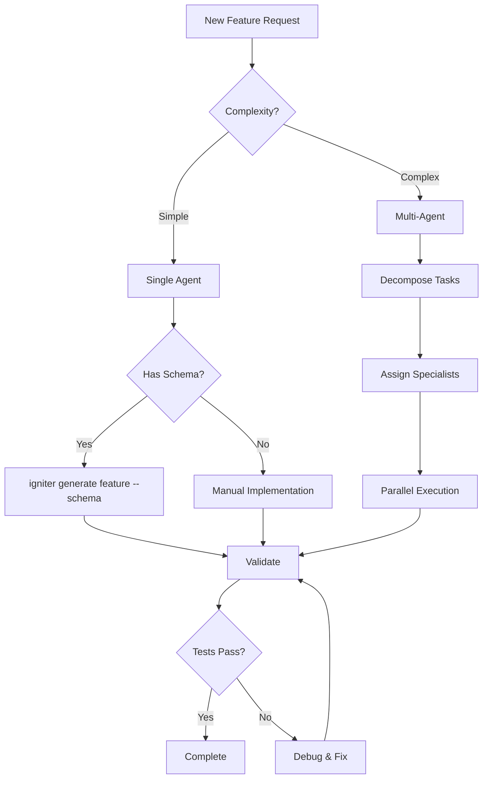

# AI Workflow Automation Rules for Igniter.js

## 🤖 AI Agent Integration Philosophy
**Code-First** • **Type-Safe** • **Predictable Patterns** • **Self-Documenting**

## 🎯 Core AI Principles

### Agent-Optimized Design
- **Consistent file structure** enables predictable navigation
- **Type inference chain** provides context without exploration
- **Self-documenting code** reduces documentation lookup
- **Feature isolation** allows parallel agent work

### Communication Protocol
- **AGENT.md files** provide feature-specific context
- **DOCS.md files** contain technical implementation details
- **JSDoc comments** explain complex logic inline
- **Type definitions** serve as contracts

## 🔴 CRITICAL AI Rules

### Context Management
- **ALWAYS** read AGENT.md before working on a feature
- **ALWAYS** preserve type chain when modifying code
- **NEVER** break established patterns without justification
- **NEVER** modify generated files directly

### Delegation Boundaries
- **DELEGATE** complete features to specialized agents
- **DELEGATE** parallel work when features are isolated
- **AVOID** delegating interdependent tasks
- **AVOID** delegating without clear acceptance criteria

## 🟡 IMPORTANT Workflow Rules

### Task Decomposition
```markdown
## Task Analysis Pattern
1. **Scope Assessment**
   - Feature boundaries
   - Dependencies identification
   - Risk evaluation

2. **Delegation Strategy**
   - Parallel opportunities
   - Agent specialization match
   - Resource optimization

3. **Execution Plan**
   - Sequential dependencies
   - Parallel branches
   - Validation gates
```

### Agent Communication
```typescript
// Feature AGENT.md Template
interface AgentContext {
  feature: string;
  purpose: string;
  dependencies: string[];
  constraints: string[];
  acceptanceCriteria: {
    functionality: string[];
    performance: string[];
    quality: string[];
  };
  testStrategy: {
    unit: string[];
    integration: string[];
    e2e: string[];
  };
}
```

## 🟢 RECOMMENDED Patterns

### Feature Development Workflow
```bash
# 1. Scaffold with AI guidance
igniter generate feature products --schema prisma:Product

# 2. Agent reads generated AGENT.md
cat src/features/products/AGENT.md

# 3. Agent implements business logic
# Following patterns from AGENT.md

# 4. Agent validates implementation
npm test -- --filter products

# 5. Agent documents in DOCS.md
# Technical details for future agents
```

### Multi-Agent Orchestration
```yaml
# .igniter/workflows/feature-development.yml
workflow: feature-development
agents:
  - name: architect
    role: Design feature structure
    outputs: [requirements.md, design.md]

  - name: backend-developer
    role: Implement API endpoints
    inputs: [design.md]
    outputs: [controllers/*, procedures/*]

  - name: test-engineer
    role: Write comprehensive tests
    inputs: [controllers/*]
    outputs: [__tests__/*]

  - name: documenter
    role: Create documentation
    inputs: [all]
    outputs: [DOCS.md, openapi.json]
```

## 🚀 Automation Patterns

### Continuous Integration
```typescript
// .igniter/hooks/pre-commit.ts
export const preCommitHook = {
  name: 'pre-commit',
  tasks: [
    'igniter generate schema',      // Regenerate client
    'igniter generate docs',         // Update OpenAPI
    'npm run typecheck',            // Verify types
    'npm test -- --changed',       // Test changes
    'npm run lint:fix'             // Fix formatting
  ],
  validation: {
    requirePass: true,
    autoFix: true
  }
};
```

### Automated Code Review
```typescript
// .igniter/agents/code-reviewer.ts
export const codeReviewerAgent = {
  triggers: ['pull_request', 'pre_commit'],
  checks: [
    {
      name: 'Type Safety',
      validate: () => checkTypeChain(),
      severity: 'error'
    },
    {
      name: 'Pattern Consistency',
      validate: () => checkPatterns(),
      severity: 'warning'
    },
    {
      name: 'Documentation',
      validate: () => checkDocs(),
      severity: 'info'
    }
  ]
};
```

## 📊 Quality Gates

### Pre-Delegation Checklist
```markdown
- [ ] Feature boundaries clearly defined
- [ ] Dependencies identified and available
- [ ] Type contracts established
- [ ] Test criteria specified
- [ ] AGENT.md created with context
- [ ] No circular dependencies
- [ ] Parallel execution possible
```

### Post-Delegation Validation
```markdown
- [ ] All tests passing
- [ ] Type safety maintained
- [ ] Documentation complete
- [ ] Patterns followed
- [ ] Performance acceptable
- [ ] Security validated
- [ ] Code reviewed
```

## 🔄 Iterative Improvement

### Learning Loop
```typescript
interface LearningCycle {
  observe: {
    metrics: ['success_rate', 'time_taken', 'quality_score'];
    patterns: ['common_errors', 'best_practices'];
  };

  analyze: {
    bottlenecks: string[];
    improvements: string[];
  };

  adapt: {
    updateTemplates: boolean;
    refinePatterns: boolean;
    improveDocumentation: boolean;
  };
}
```

### Knowledge Persistence
```typescript
// .igniter/memory/patterns.ts
export const learnedPatterns = {
  successful: [
    {
      pattern: 'repository-procedure',
      context: 'Database access',
      successRate: 0.95,
      template: 'templates/repository.hbs'
    }
  ],

  problematic: [
    {
      pattern: 'circular-dependency',
      context: 'Feature coupling',
      solution: 'Use dependency injection'
    }
  ]
};
```

## 🎭 Agent Specialization

### Backend Specialist
```yaml
capabilities:
  - Controller implementation
  - Database operations
  - API design
  - Performance optimization

tools:
  - igniter generate feature
  - igniter generate controller
  - igniter generate procedure
  - prisma commands

context_files:
  - src/igniter.router.ts
  - src/igniter.context.ts
  - prisma/schema.prisma
```

### Frontend Specialist
```yaml
capabilities:
  - React components
  - Hook implementation
  - State management
  - UI/UX patterns

tools:
  - Component generation
  - Hook creation
  - Style systems

context_files:
  - src/igniter.client.ts
  - src/providers/*
  - src/components/*
```

### Testing Specialist
```yaml
capabilities:
  - Unit testing
  - Integration testing
  - E2E testing
  - Performance testing

tools:
  - vitest
  - playwright
  - k6

context_files:
  - **/__tests__/*
  - vitest.config.ts
  - playwright.config.ts
```

## 🛡️ Safety Mechanisms

### Rollback Strategy
```bash
# Before risky operations
git commit -am "Checkpoint before feature X"

# If delegation fails
git reset --hard HEAD^

# Alternative: branch strategy
git checkout -b ai/feature-x
# ... delegation work ...
# If successful
git checkout main && git merge ai/feature-x
```

### Validation Gates
```typescript
// .igniter/gates/feature-complete.ts
export const featureCompleteGate = {
  requirements: [
    'All endpoints responding',
    'Tests coverage > 80%',
    'Types fully defined',
    'Documentation complete',
    'No TODO comments',
    'Performance benchmarks met'
  ],

  autoCheck: async () => {
    const results = await Promise.all([
      checkEndpoints(),
      checkCoverage(),
      checkTypes(),
      checkDocs(),
      checkTodos(),
      checkPerformance()
    ]);

    return results.every(r => r.passed);
  }
};
```

## 📈 Metrics & Monitoring

### Agent Performance
```typescript
interface AgentMetrics {
  taskId: string;
  agent: string;
  startTime: Date;
  endTime: Date;
  success: boolean;
  quality: {
    codeQuality: number;  // 0-100
    testCoverage: number; // 0-100
    documentation: number; // 0-100
    performance: number;  // 0-100
  };
  errors: string[];
  learnings: string[];
}
```

### Workflow Analytics
```typescript
// .igniter/analytics/workflow.ts
export const analyzeWorkflow = (metrics: AgentMetrics[]) => {
  return {
    avgCompletionTime: calculateAverage('duration'),
    successRate: calculateRate('success'),
    qualityScore: calculateAverage('quality'),
    bottlenecks: identifyBottlenecks(),
    recommendations: generateRecommendations()
  };
};
```

## 🚦 Decision Trees

### Feature Implementation


## 🎯 Success Criteria

### Feature Completeness
- ✅ All CRUD operations functional
- ✅ Input validation comprehensive
- ✅ Error handling robust
- ✅ Tests achieving >80% coverage
- ✅ Documentation explains all endpoints
- ✅ Types fully defined and exported
- ✅ Performance within benchmarks

### Code Quality
- ✅ Follows established patterns
- ✅ No type safety violations
- ✅ No ESLint errors
- ✅ No circular dependencies
- ✅ Procedures properly utilized
- ✅ Context correctly extended
- ✅ Revalidation properly configured

## 🔮 Future Automation

### Planned Enhancements
1. **Auto-delegation** based on task analysis
2. **Self-healing** code corrections
3. **Performance auto-tuning**
4. **Automated dependency updates**
5. **AI-powered code reviews**
6. **Intelligent test generation**
7. **Documentation auto-sync**

### Integration Points
- GitHub Actions for CI/CD
- Vercel for deployment
- Sentry for error tracking
- DataDog for monitoring
- Linear for task management
- Slack for notifications

---

**Remember**: These automation rules enable efficient AI-driven development while maintaining code quality and type safety. The framework is designed to be AI-friendly from the ground up, making delegation and automation natural extensions of the development process.